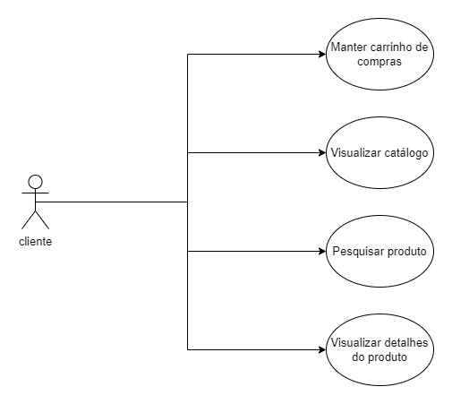

# Desafio Final | E-commerce

 

<!-- ## 🖼 Pré-visualização -->

## ℹ Descrição

Este projeto foi desenvolvido pelo squad Jaqueline Goes como solução do desafio final do Bootcamp Python Back-end da WomakersCode. A aplicação consiste em um e-commerce desenvolvido em Python + Django.

## 🧾 Diagramas UML

### Diagrama de casos de uso

### Diagrama de classes

<!-- ## Como utilizar  -->

## Contribuição

Caso encontre algum bug, sinta-se à vontade para abrir uma issue ou submeter um Pull Request.

---

Obrigada por visitar nosso projeto. 💜